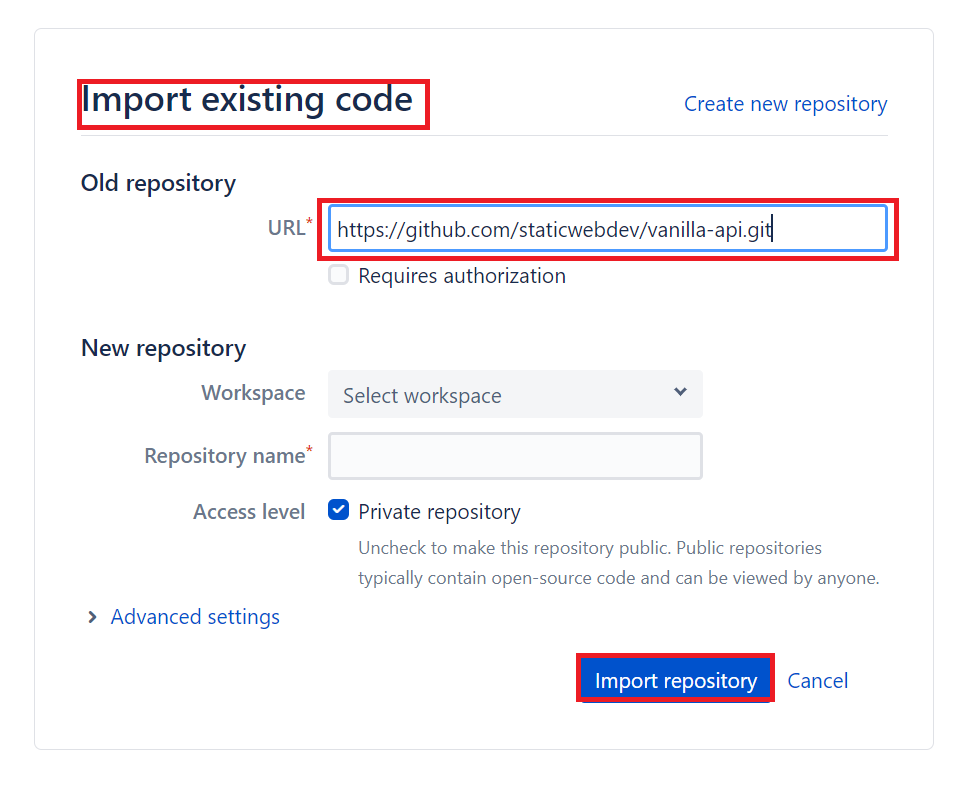
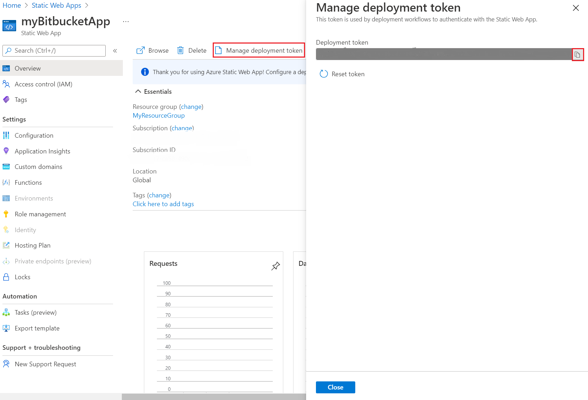

# Tutorial: Publish Azure Static Web Apps with Bitbucket

This article demonstrates how to deploy to [Azure Static Web Apps](./overview.md) using [Bitbucket](https://bitbucket.org/).

In this tutorial, you learn to:

- Set up an Azure Static Web Apps site
- Create a Bitbucket Pipeline to build and publish a static web app

## Prerequisites

- **Active Azure account:** If you don't have one, you can [create an account for free](https://azure.microsoft.com/free/).
- **Bitbucket project:** If you don't have one, you can [create a project for free](https://confluence.atlassian.com/bitbucketserver/creating-projects-776639848.html).
  - Bitbucket includes **Pipelines**. 
  
   > [!NOTE]
   > The static web app Pipeline Task currently only works on **Linux** machines. When running the pipeline mentioned below, please ensure it is running on a Linux VM.

## Create a static web app repo in Bitbucket

  > [!NOTE]
  > If you have an existing app in your repository, you may skip to the next section.

1. Create/Import a new repository in Bitbucket.

1. Select **Import repository** to import the sample application.
  
     

1. In **Old repository URL**, enter `https://github.com/staticwebdev/vanilla-api.git`.

1. Choose your project and name your repository.

1. Select **Import repository**.

## Create a static web app

1. Navigate to the [Azure portal](https://portal.azure.com).

1. Select **Create a Resource**.

1. Search for **Static Web Apps**.

1. Select **Static Web Apps**.

1. Select **Create**.

1. Create a new static web app with the following values.

    | Setting | Value |
    |---|---|
    | Subscription | Your Azure subscription name. |
    | Resource Group | Select an existing group name, or create a new one. |
    | Name | Enter **myBitbucketApp**. |
    | Hosting plan type | Select **Free**. |
    | Region | Select a region closest to you. |
    | Source | Select **Other**. |

    


1. Select **Review + create**

1. Select **Create**.

1. Once the deployment is successful, select **Go to resource**.

1. Select **Manage deployment token**.

1. Copy the **deployment token** and paste the deployment token value into a text editor for use in another screen.

    > [!NOTE]
    > This value is set aside for now because you'll copy and paste more values in coming steps.

    

## Create the Pipeline in Bitbucket

1. Navigate to the repository in Bitbucket that was created earlier.

2. Select **Pipelines** on the left menu.

3. If you haven't created a pipeline before, you first have to enable two-step verification for your Bitbucket account.

4. You can add SSH Keys using the steps [here](https://support.atlassian.com/bitbucket-cloud/docs/set-up-an-ssh-key/)

5. Select **Create your first pipeline**.

    

6. In the *Create your first pipeline* screen, select **Starter pipeline**.

    

7. Copy the following YAML and replace the generated configuration in your pipeline with this code.

    ```yaml
    pipelines:
      custom:
       custom-pipeline:
        - step: 
            name: Deploy to test
            deployment: test
            script:
              - pipe: microsoft/azure-static-web-apps-deploy:main
                variables:
                    APP_LOCATION: '$BITBUCKET_CLONE_DIR/src'
                    API_LOCATION: '$BITBUCKET_CLONE_DIR/api'
                    OUTPUT_LOCATION: '$BITBUCKET_CLONE_DIR'
                    API_TOKEN: $deployment_token
    ```

    > [!NOTE]
    > If you are not using the sample app, the values for `APP_LOCATION`, `API_LOCATION`, and `OUTPUT_LOCATION` need  to change to match the values in your application.
    > 
    > Note that you have to give the values for `APP_LOCATION`, `API_LOCATION`, and `OUTPUT_LOCATION` only after `$BITBUCKET_CLONE_DIR` as shown above.

    [!INCLUDE [static-web-apps-folder-structure](../../blob/main/includes/static-web-apps-folder-structure)]

    The `API_TOKEN` value is self managed and is manually configured.

8. Select **Add variables**.

9. Add a new variable in **Deployments** section.

10. Name the variable **deployment_token** (matching the name in the workflow).

11. Copy the deployment token that you previously pasted into a text editor.

12. Paste in the deployment token in the _Value_ box.

    

13. Make sure the **Secured** checkbox is selected.

14. Select **Add**.

15. Select **Commit file** to return to your pipelines tab.

16. Select **Run Pipeline**. Choose your **Branch** and **Pipeline** and click **Run**.

    

17. This will run the pipeline with name **Initial Bitbucket Pipelines configuration**.

18. Once the deployment is successful, navigate to the Azure Static Web Apps **Overview** which includes links to the deployment configuration. Note how the _Source_ link now points to the branch and location of the Bitbucket repository.

19. Select the **URL** to see your newly deployed website.

    

## Clean up resources

Clean up the resources you deployed by deleting the resource group.

1. From the Azure portal, select **Resource group** from the left menu.
2. Enter the resource group name in the **Filter by name** field.
3. Select the resource group name you used in this tutorial.
4. Select **Delete resource group** from the top menu.


## Additional resources

1. If you need help getting started with Pipelines, see [Create your first pipeline](https://support.atlassian.com/bitbucket-cloud/docs/get-started-with-bitbucket-pipelines/).
2. 
